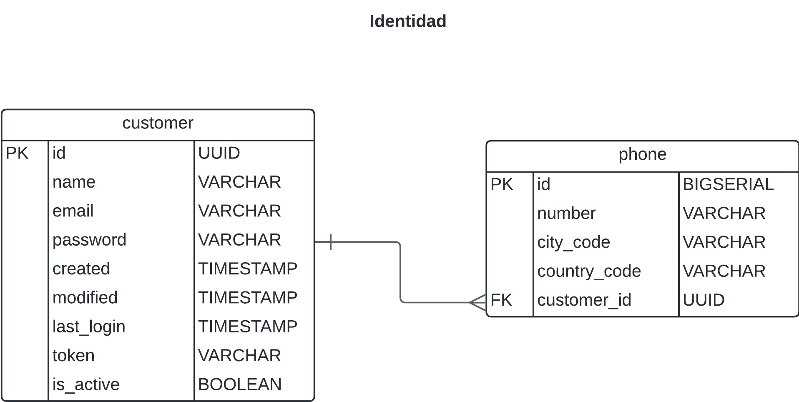
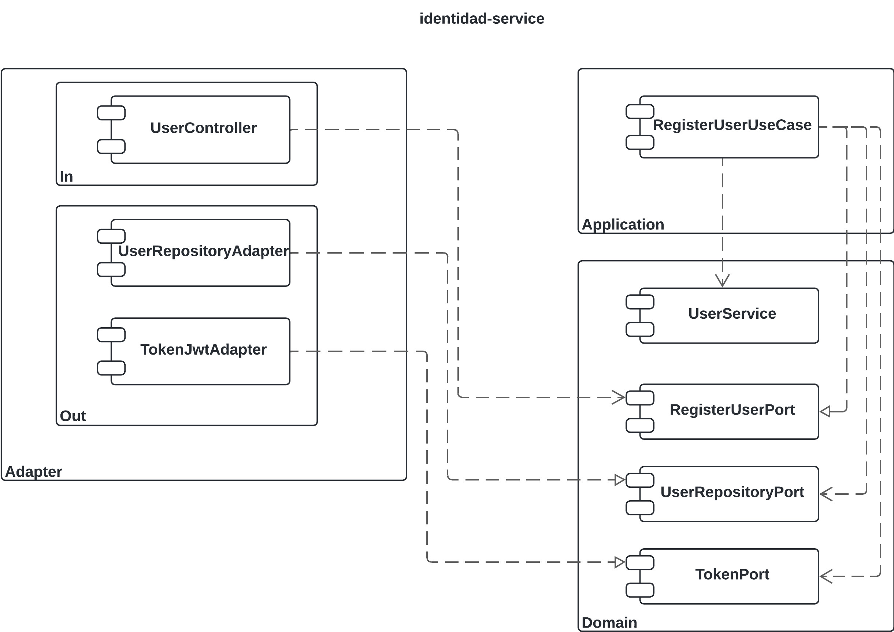

# Identidad Service

Microservicio que proprociona API para el registro de usuarios

## Requisitos

- JDK 17
- Docker
- Maven

## Construir y ejecutar el Proyecto

### Compilar el proyecto

 - Con aplicacion maven: 

	mvn clean package

 - Utilizando el mvn del proyecto. Para ello debes ingresar a la carpeta raiz del proyecto y ejecutar el comando:
 
	.\mvnw.cmd clean package
 

### Ejecucion con Docker

##### 1. Construir la Imagen Docker

En el directorio raíz del proyecto, ejecutar el siguiente comando para crear la imagen Docker:

docker build -t identidad-service:1.0.0 .

##### 1. Ejecutar el Contenedor Docker

docker run -p 8080:8080 identidad-service:1.0.0

### Ejecutar con el .jar

java -jar target/identidad-service-0.0.1-SNAPSHOT.jar

## Probar el servicio

  - Url: http://localhost:8080/api/v1/users
  - validation.user.emailRegex=^[a-zA-Z0-9._]+@[a-zA-Z0-9]+\\.[a-zA-Z]{2,}$
  - validation.user.passwordRegex=^(?=.*[0-9])(?=.*[a-zA-Z])[0-9a-zA-Z]{6,}$

## Script de Base de Datos

El script para crear la base de datos se encuentra en la carpeta database del proyecto con el nombre identidad.sql

###Modelo entidad relacion

## Diagrama del microservicio

